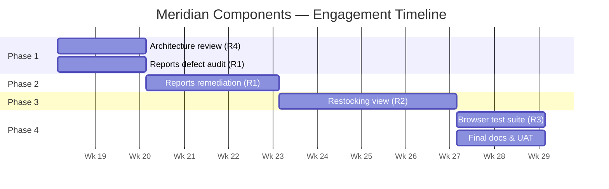

# Timeline

**RFP MC-2026-0417 — Inventory Dashboard Modernization**

---

We propose an 11-week engagement delivered in four sequential phases. Phases are ordered to front-load risk: architecture review and defect audit happen before any fixes are committed, ensuring we have a complete picture before spending budget on remediation.

| Phase | Weeks | Work |
|---|---|---|
| 1 — Orientation & Audit | 1–2 | Architecture review (R4) + Reports defect audit (R1) |
| 2 — Reports Remediation | 3–5 | Resolve in-scope defects from audit register (R1) |
| 3 — Restocking View | 6–9 | Design, build, and integrate new Restocking capability (R2) |
| 4 — Test Coverage & Handoff | 10–11 | Playwright test suite (R3) + final documentation + UAT |

---

### Phase 1 — Orientation & Audit (Weeks 1–2)

We will stand up the application locally, conduct the independent codebase review that produces the R4 architecture documentation, and run the Reports module audit that produces the R1 defect register. These two workstreams run in parallel and share the same discovery effort. By the end of week 2 Meridian will have a complete defect register and a draft architecture document — both before any code changes are made.

**Milestone:** Defect register delivered and agreed with Meridian before remediation begins.

### Phase 2 — Reports Remediation (Weeks 3–5)

Working from the agreed defect register, we will resolve all in-scope defects (up to 15), test each fix, and update the register to reflect resolved status. Meridian will have visibility into progress throughout; we will not deliver a batch of changes at the end.

**Milestone:** Reports module remediated; defect register closed.

### Phase 3 — Restocking View (Weeks 6–9)

Design and build the Restocking recommendations view — backend endpoint, frontend view, filter integration, and navigation wiring. We will share a working build with Meridian's operations team mid-phase (end of week 7) to collect early feedback before final delivery.

**Milestone:** Restocking view delivered and accepted by operations team.

### Phase 4 — Test Coverage & Handoff (Weeks 10–11)

Write and validate the Playwright test suite against the completed application. Deliver final architecture documentation. Conduct user acceptance testing with Meridian's team and resolve any punch-list items within scope.

**Milestone:** Test suite passing in CI; all deliverables handed over; engagement closed.

---

**Assumptions.** Timeline assumes Meridian provides timely access to a test environment and that the operations team is available for a mid-phase review in week 7. Defects identified in Phase 1 that exceed the 15-item cap are scoped as a change order before Phase 2 begins — this does not delay Phase 2 if the in-scope set is agreed promptly.
